# Plan For 'Color Cloud'

每一项后面有优先度, 类似于[2]的形式
-1 表示暂时不做
0 表示已完成
其他情况, 正整数越大, 表示优先度越高

目前打算所有UI由一人完成, 然后UI还要实现一下对于硬件输入和游戏输入的映射层, 即键鼠和手柄的操作都应该映射为一个游戏的输入. 比如手柄的A和鼠标左键都映射为一个游戏输入Yes枚举常量, 这样游戏的具体操作只需要利用游戏输入来响应, 方便兼容多种操作方式以及改变键位.

道具, 武器和玩家的数据类, 以及玩家的行为类等由一人完成. 注意接口的设计, 数据与操作分离的原则(实在做不到也没事).

游戏的流程, 机制, 场景要素等由一人完成. 可以考虑多使用单例模式. 负责这方面的人可能要多和其他人交流交流.

然后各个方面的对接, 接口的改进由一人完成.

程序写代码时, 最好能参照API.md, 写一下自己负责部分的API文档.

## Basic Framework

- 一些基本实体
- Gaming UI(游戏时UI)
- Game Settings System and Panel(一场游戏的设置(比如几支队伍, 几个人, 几个机器人, 场景选择, 时限等等)和设置界面)
- Game Mechanics(游戏机制, 比如如何判断胜负, 角色的复活, 道具的生成, 重力的参数等等)
- Config System and Panel
- Main Panel
- Game End Panel
- Weapons(一些具体的武器)
- Scene Element(一些具体的场景要素, 比如飞机等会干扰玩家操作的场景, 可以站立的云朵, 会洗刷云朵色彩的乌云等等)

## 一些基本实体

### Player相关

#### 策划能自行调整的数值

- 名称
- 质量
- 下降加速度
- 最大下降速度
- 左右移动速度
- 颜料量上限
- 颜料槽抗污染量(相当于血量)
- 颜料槽抗污染程度(相当于防御值)
- 初始武器
- 携带的技能
- 颜料阵营
- 携带的道具

#### 其他数据

- 伤害量, 人头数, 受伤害量等结算有用的数据

#### 行为

- 左右移动[1]
  - 方式: a, d, 手柄l摇杆
  - 注意: 转向, 惯性

- 喷气背包/垂直方向移动[1]
  - 方式: w, s, 手柄l摇杆
  - 当背景是己方颜色时
    - 不进行垂直移动时会很慢的**匀速下降(留出调整界面给策划)**.
    - 移动时并不会消耗颜料槽的颜料
  - 当背景非己方颜色时
    - 不进行垂直移动时**加速下降(有最大值)**
    - 移动时会消耗颜料槽, 否则无法向上移动
  - 注意: 喷漆飞行的手感
  - 飞行经过的地方会染色(染色先交给负责武器部分的程序实现, 后面再对接)

- 补充颜料并净化颜料槽[1]
  - 在云朵上进行汲取操作
    - 方式: 空格键, 手柄X键
    - 此时不能使用道具, 攻击, 技能
    - 移动时汲取颜料恢复速度变慢, 移动速度也变慢
    - 背后的颜色不是己方时, 速度变慢
    - 受到颜色攻击时会被打断
    - 最慢不应让也应该能让玩家在不受伤的情况下能够渐渐向上飞

- 拾取道具[2]
  - 方式: E键, 手柄Y键
  - 最多持有两个道具

- 切换手上持有物(武器\道具1\道具2) [2]
  - 方式: 鼠标滚轮, 手柄RB\LB
  - 要在角色手上显示出来, 同时也有对应的UI显示3个可持有物
  
- 角色技能 [2]
  - 技能A, 技能B触发: CD满的情况且满足先行条件(看技能而定)的情况下, 按鼠标右键/q, 手柄LT/b
  - 技能A应该是cd短的技能, 技能B的cd比较长

- 攻击 [1]
  - 方式: 鼠标左键\手柄RT
  - 瞄准: 鼠标移动\手柄r摇杆(当是普通的连续喷射武器时, 手柄移动摇杆就算发动攻击了)
  - 当手上持有武器或可攻击道具时才可攻击
  - 一些武器或道具会消耗颜料
  - 一些武器或道具会有后坐力

- 使用道具 [2]
  - 基本上使用和瞄准等操作得类似于武器的操作(除一些特殊道具)
  - 方式: 左键\手柄RT

- 被颜料子弹或者颜料近战攻击 [1]
  颜料攻击对于玩家的影响是
   1. 对于己方, 减少颜料槽的污染, 无击退
   2. 对于敌方, 增加颜料槽的污染, 有击退

### Bullet(子弹)相关

#### 数据

- 颜色
- 大小
- 剩余射程
- 速度, 质量, 所受重力的g等物理方面的
- 击退力
- 污染力(即在抗污染系数为1的情况下的伤害量)
- 爆炸半径(即在到达射程或者碰到实体后的爆炸半径)

#### 行为

- 给背景染色, 染色的同时, 自身大小会减小 [1]
- 运行到射程后, 爆炸. [1]
- 爆炸考虑自身大小和爆炸半径数值. [1]
- 撞到实体后爆炸, 并对实体造成影响(击退, 污染颜料槽等) [1]
- 撞到异色的子弹不会爆炸, 而会互相抵消至一方子弹消失. 具体如何抵消是看子弹大小的 [1]
- 撞到同色的东西, 不会消耗大小, 而会穿过去 [1]
- 运动方式, 有些特殊的子弹可能会有特殊的前进方式 [3]

### Weapon(武器)相关

#### 策划能自行调整的数值

- 名字
- 类型: 远程武器/特殊武器/近战武器/道具
- 子弹原型
- 射程
- 射速
- 一次射击射出的子弹数目
- 精准度: 越低, 相对于瞄准方向的偏移角度越大, 很低的话可以达到散射的效果
- 击退力
- 颜料消耗量
- 污染力
- 爆炸半径
- 子弹随机程度
- 使用次数(初始武器是无限, 不过道具啥的不一样)

注意到这里有和子弹数据重合的地方, 其实子弹的数值应该是由武器基础类型+玩家buff+子弹随机程度共同决定的

#### 行为

- 满足先行条件的情况下, 能够向指定方向射击(注意对于近战武器的特殊处理) [1]
- 射击后的损耗 [1]
- 手持该武器时可能会对玩家有一些增益或者其他影响 [1]

## Gaming UI [1]

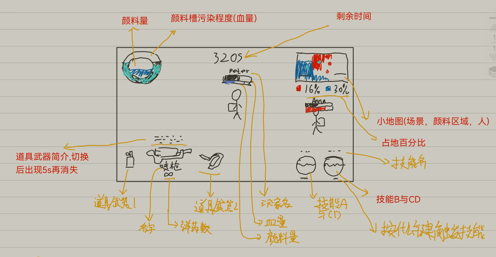  

- 应该要有瞄准虚线的
- 目前要求画面呈现出整个地图, 因为目前是同屏游戏. 所以也不需要视角跟随什么的了.
- 技能, 小地图, 不是正在持有的道具的显示[2]
- 虽然优先度不是最高, 但还是记得不要写死了, 否则不好修改

## Game Settings System and Panel

1. 第一部分, 游戏配置 [2]
  
   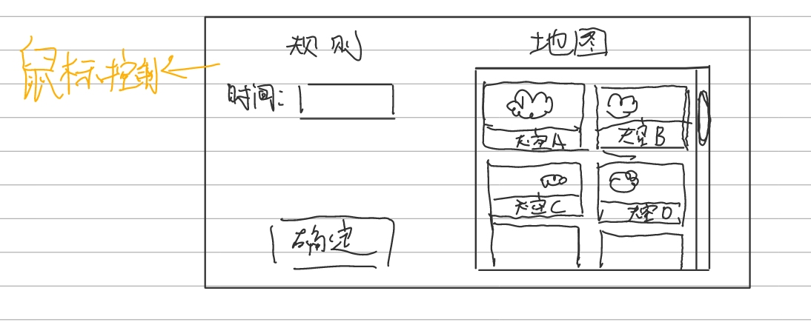  

   - 时间调整
   - 地图选择
   - 确定后保存数据, 供生成游戏时使用

2. 第二部分, 分队 [1]

   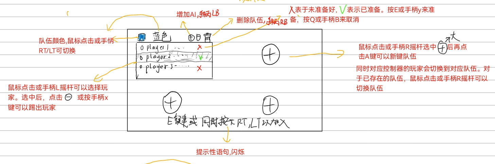  

   - 队伍选择/增减队伍/改变队伍颜色
   - 增加ai(ai先不考虑实现行为)
   - 踢人
   - 自动检测手柄连接, 并提示同时按下RT与LT来加入游戏(默认首先加入第一队)
   - 选择完成(每个人按回车或者手柄的Y来说明准备就绪, 所有人都准备好后即选择完成)
   - 选择完成后把队伍数据传递给下一场景

3. 第三部分, 配置人物 [1]

   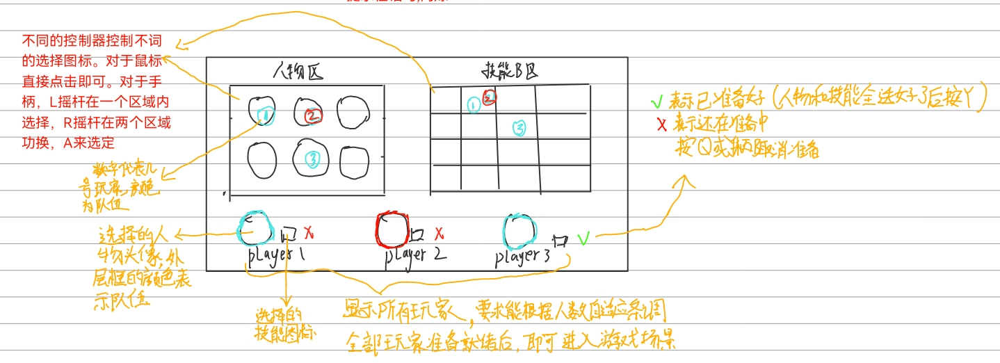  

   - 人物选择(暂时先只绑定技能A与初始武器)
   - 技能B选择
   - 准备完成
   - 把人物数据, 这局游戏的设置数据(地图, 时限), 传递给游戏场游戏场景

## Game Mechanics

### 基本流程 [1]

1. 读取这局游戏的配置, 生成或读取地图, 生成所有玩家
2. **倒计时**, 玩家不可操作, 但背景可以有动画
3. 游戏开始, 有时限的模式下开始计时, 同时开始根据地图, 间隔**一定/或随机**的时间**随机或定点**生成在这局游戏**道具列表**的. 道具生成[2]
4. 距离游戏结束前**一定时间**提示玩家, 道具生成时间间隔等可以有一定变化
5. 游戏结束前**10s**倒计时
6. 游戏结束, 生成获胜者, 面积比例, kill,dead数等数据给游戏结束场景

### 基本机制 [1]

1. 在有时限的情况下, 越接近游戏结束时, **复活时间越少**(目的是增强翻盘的概率)
2. 复活时, 颜料槽补满, 颜料槽污染程度归零, 同时周身**一定范围**内的颜色变为己方颜色, 复活
   的位置**随机/顶点**
3. 玩家掉出地图(左右和下)会死亡, 颜料槽污染程度满时会死亡
4. 颜料攻击对于地图的影响是, 将经过的地方染色, 同时对于远程类型的攻击而言, 染色越多, 子弹变越小, 直至消失或达到最大射程而消失(换言之, 在己方颜色区域射出能射很远)
5. 颜料攻击对于玩家的影响是
   1. 对于己方, 减少颜料槽的污染, 无击退
   2. 对于敌方, 增加颜料槽的污染, 有击退
6. 在己方颜色区域作战优势很大
   1. 首先, 喷射飞行不会消耗颜料
   2. 其次, 汲取颜料时, 获取的颜料和净化颜料槽的程度会更大(无颜色时减慢, 不在己方区域时最慢)

### 普通模式 [1]

- 队伍2~4, 每队人数1~4(先考虑两队的情况, 不过写代码时要注意为后面的修改兼容)
- 无限复活
- 有**时限**
- 获胜判定: 颜料占据面积最多的一方胜利

### 对战模式[-1]

- 队伍2~4, 每队人数1~4
- 无限复活
- 有**时限**
- 获胜判定: 人头数最多的一方胜利

### 生存模式[-1]

- 队伍2~4, 每队人数1~4
- 每个人生命数有限
- 无**时限**
- 获胜判定: 活到最后的一队获胜

## Config System and Panel [3]

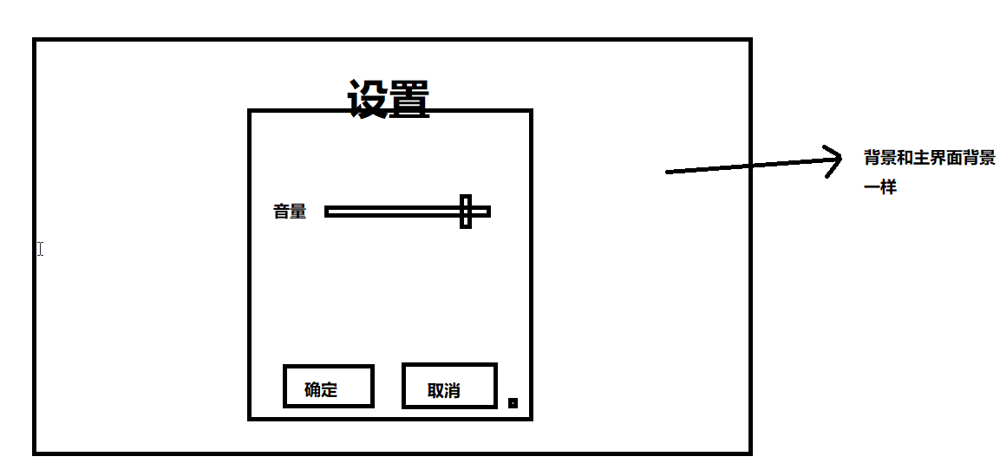  

- 能够读取当前配置以正常显示
- 音量调整
- 键位绑定(暂时不做)
- 取消的话设置保持修改前的模样
- 确定的话修改并更新配置文件

## Main Panel [1]

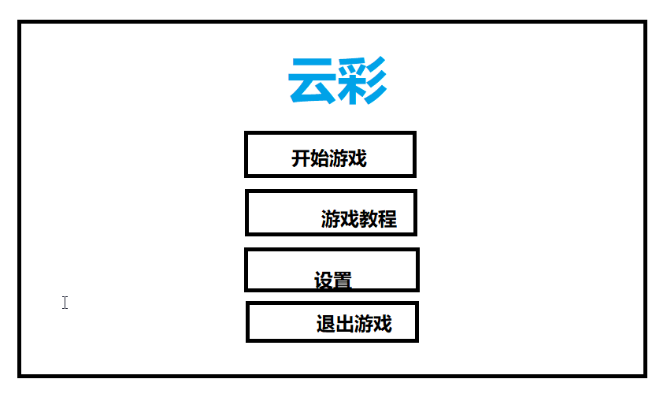  

## Game End Panel [2]

## Weapons(一些具体的武器)

### 远程

- 颜料弹射枪 [1]
  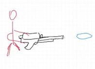  

  - 特点: 无
  - 设计想法: 综合的, 能攻能染色的武器
- 颜料喷射者 [1]
  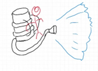  

  - 特点: 使用者移动速度下降
  - 设计想法: 攻击性弱的, 主要目标是染色以及为队友提供掩护

### 近战

- 颜料小刷 [1]
  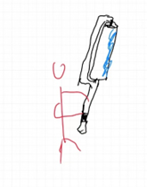  

  - 特点: 类似于刀, 能打破子弹, 使用者移动速度上升

### 道具 [2]

- 颜料炸弹
  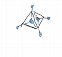  

  - 特点: 使用三次, 使用瞄准了按使用键扔出, 再按一次使用键爆炸.

- 大刷子
  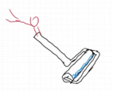  

  - 特点: 使用一次, 在道具生效期间内能不消耗颜料的横冲直撞, 收到很弱的击退时不会有影响, 冲过的地方会被染色

- 染色桶
  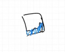  

  - 特点: 使用一次, 颜料全部消耗, 使用后颜色以使用者为中心逐渐扩散, 使用者不能移动，扩散效果会被**一定程度**以上击退效果打断

## Scene Element(一些具体的场景要素)

### 鸟 [1]

  随机在场景任意处生成，飞行过程中在**未被染色区域**进行排泄，排泄物会对场景进行染色，可被玩家染色，且染色后排泄物亦为此颜色

#### 策划可以调整数据

- 飞行速度
- 排泄频率(随机一点也行)
- 染色范围
- 染色持续时间（即被玩家染色后何时恢复原来的颜色）
- 飞行持续时间(或者说什么时候离开地图)

#### 行为

- 地图上乱飞 [1]
- 被攻击后染色(没被攻击前就是白色) [1]
- 随机排遗 [1]

### 喷泉 [1]
  
  在场景底部任意处生成，产生向上的水柱，对喷泉上方的矩形区域进行冲刷，冲洗掉其上的所有颜色，玩家被喷中后颜料会持续减少
  
#### 策划可以调整的数据

- 高度
- 宽度
- 持续时间
- 冲刷速度(玩家被击中颜料减少速度), 或者减少一定的量也可以

#### 行为

- 底部随机生成 [1]
- 向上方喷水柱, 水柱能冲刷掉颜色, 喷到玩家会有击退, 减少颜料, 但能减少颜料槽的污染程度(或者说回血) [1]

### 普通云朵平台和墙 [1]

就是提供站立的地方, 抵挡子弹以及拦截敌人的墙

#### 策划可以调整的数据

- 位置
- 长边的方向
- 摩擦力
